# 🤖 Agentathon - Building AI Agents with Microsoft Copilot Studio

<p align="center">
  
</p>

[](https://www.microsoft.com/es-es)
[](https://www.microsoft.com)
[](https://copilotstudio.microsoft.com)

---

## 📖 Overview

The **Agentathon** is an innovative initiative developed by the **COI (Community of Interest) Team in Spain** to help customers accelerate their journey into building AI agents using **Microsoft Copilot Studio**. This hands-on workshop format enables organizations to rapidly prototype and build functional AI agents in a collaborative, time-boxed environment.

> 💡 **What is an Agentathon?** A focused workshop where participants learn to design, build, and deploy AI agents using Microsoft Copilot Studio, guided by Microsoft experts.

---

## 🇪🇸 Spain: A Global Leader in Agentic AI Solutions

According to the [Microsoft AI Diffusion Report 2025 H2](https://www.microsoft.com/en-us/research/wp-content/uploads/2026/01/Microsoft-AI-Diffusion-Report-2025-H2.pdf), **Spain ranks third globally** in the adoption and implementation of agentic AI solutions.

<p align="center">
  
</p>

### Why Spain Leads in Agentic Solutions

| Factor | Description |
|--------|-------------|
| 🏢 **Enterprise Adoption** | High engagement from financial services, retail, and manufacturing sectors |
| 🎓 **Innovation Culture** | Strong collaboration between Microsoft and Spanish enterprises |
| 🚀 **Early Adoption** | Quick adoption of Copilot Studio and agentic frameworks |
| 👥 **Community Engagement** | Active participation in Agentathon events across the country |

---

## 🎯 Impact & Success Metrics

The Agentathon initiative has delivered significant impact across Spanish enterprises:

### Key Results from Recent Events

- **Bankinter Agentathon (January 2025)**: Successfully engaged multiple teams in building AI agents for banking operations
- Multiple customer engagements with positive feedback and production-ready prototypes
- Growing community of AI agent builders across Spain

### Business Impact

| Metric | Result |
|--------|--------|
| 📈 **Customer Satisfaction** | High engagement and positive feedback |
| ⚡ **Time to Value** | Rapid prototyping in hours, not weeks |
| 🎯 **Use Cases Identified** | Multiple production-ready scenarios per event |
| 🤝 **Team Collaboration** | Cross-functional team participation |

---

## 📂 Repository Structure

```
Agentathon/
├── README.md                    # This file
├── CONTRIBUTING.md              # How to contribute and run your own Agentathon
├── materials/
│   ├── preparation/             # Pre-event preparation materials
│   ├── prerequisites/           # What you need to know before the event
│   └── session-content/         # Workshop content and exercises
├── success-stories/
│   └── spain/                   # Success stories from Spanish customers
├── assets/
│   ├── images/                  # Screenshots, diagrams, and visuals
│   └── templates/               # Reusable templates
└── resources/
    └── links.md                 # Useful links and references
```

---

## 🚀 How to Run an Agentathon

### The Agentathon Process

```mermaid
flowchart LR
    A[📋 Preparation] --> B[🎓 Prerequisites]
    B --> C[🎯 Use Case Discovery]
    C --> D[🛠️ Hands-on Building]
    D --> E[🎤 Demo & Feedback]
    E --> F[📈 Follow-up]
```



### Phase 1: Preparation (2-4 weeks before)

1. **Identify Target Audience**: Select participants from IT, business, and operations teams
2. **Define Objectives**: Establish clear goals for the Agentathon
3. **Environment Setup**: Ensure Copilot Studio licenses and Azure resources are ready
4. **Communication**: Send invitations and pre-reading materials

📁 See: [materials/preparation/](materials/preparation/)

### Phase 2: Prerequisites Training (1 week before)

1. **Introduction to AI Agents**: What are agents and why they matter
2. **Copilot Studio Basics**: Familiarization with the platform
3. **Use Case Templates**: Pre-defined scenarios to accelerate building

📁 See: [materials/prerequisites/](materials/prerequisites/)

### Phase 3: The Agentathon Event (1-2 days)

#### Day 1: Discovery & Design
- Welcome and objectives setting
- Use case discovery workshop
- Agent design session
- Begin building with Copilot Studio

#### Day 2: Build & Demo
- Continue building agents
- Testing and refinement
- Demo presentations
- Feedback and next steps

📁 See: [materials/session-content/](materials/session-content/)

### Phase 4: Follow-up

1. **Documentation**: Capture learnings and best practices
2. **Production Path**: Define roadmap to production
3. **Community**: Join the Agentathon alumni network

---

## 📚 Materials

### 📋 Preparation Materials
- [Preparation Checklist](materials/preparation/checklist.md)
- [Environment Setup Guide](materials/preparation/environment-setup.md)
- [Communication Templates](materials/preparation/communication-templates.md)

### 🎓 Prerequisites
- [Introduction to AI Agents](materials/prerequisites/intro-to-agents.md)
- [Copilot Studio Overview](materials/prerequisites/copilot-studio-overview.md)
- [Use Case Discovery Guide](materials/prerequisites/use-case-discovery.md)

### 🛠️ Session Content
- [Workshop Agenda](materials/session-content/agenda.md)
- [Hands-on Exercises](materials/session-content/exercises.md)
- [Demo Scenarios](materials/session-content/demo-scenarios.md)

---

## 🏆 Success Stories

### Spain Customer Stories

| Customer | Industry | Use Case | Outcome |
|----------|----------|----------|---------|
| [Bankinter](success-stories/spain/bankinter.md) | Banking | Customer Service Agents | [Placeholder] |
| [Customer 2](success-stories/spain/customer-2.md) | [Industry] | [Use Case] | [Placeholder] |
| [Customer 3](success-stories/spain/customer-3.md) | [Industry] | [Use Case] | [Placeholder] |

📁 See all stories: [success-stories/spain/](success-stories/spain/)

---

## 🔗 Useful Links

### Microsoft Resources
- [Microsoft Copilot Studio](https://copilotstudio.microsoft.com) - Build AI agents
- [Microsoft Learn - Copilot Studio](https://learn.microsoft.com/en-us/microsoft-copilot-studio/) - Official documentation
- [Microsoft AI](https://www.microsoft.com/en-us/ai) - AI solutions overview
- [Microsoft AI Diffusion Report](https://www.microsoft.com/en-us/research/wp-content/uploads/2026/01/Microsoft-AI-Diffusion-Report-2025-H2.pdf) - Spain ranking insights

### Additional Resources
- [Placeholder - Internal Training Link]
- [Placeholder - Partner Resources]
- [Placeholder - Community Forum]

---

## 👥 Team Behind the Agentathon

This initiative was developed by the **Microsoft COI Team in Spain**, bringing together expertise in AI, customer success, and technical enablement.

### Contact

For questions about running your own Agentathon, please reach out:

- 📧 Email: [Placeholder - Team Email]
- 💬 Teams: [Placeholder - Teams Channel]
- 🐙 GitHub: [@Fepilot](https://github.com/Fepilot)

---

## 🤝 Contributing

We welcome contributions from teams across Microsoft who want to run their own Agentathons or share their success stories!

See [CONTRIBUTING.md](CONTRIBUTING.md) for guidelines.

---

## 📜 License

This project is internal to Microsoft. Please refer to Microsoft's internal policies for usage guidelines.

---

<p align="center">
  <strong>Built with ❤️ by the Microsoft COI Team in Spain</strong>
</p>

<p align="center">
  
</p>
