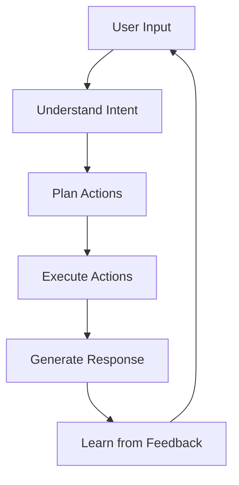

# 🤖 Introduction to AI Agents

Learn the fundamentals of AI agents and why they matter for your organization.

---

## 📖 What is an AI Agent?

An **AI Agent** is an intelligent system that can:

- **Understand** natural language requests
- **Reason** about how to accomplish tasks
- **Take actions** autonomously or semi-autonomously
- **Learn** from interactions to improve over time

### Traditional Chatbots vs AI Agents

| Aspect | Traditional Chatbot | AI Agent |
|--------|---------------------|----------|
| **Interactions** | Rule-based, scripted | Dynamic, contextual |
| **Capabilities** | Answer predefined questions | Execute complex tasks |
| **Learning** | Static | Continuously improving |
| **Integration** | Limited | Deep system integration |
| **Autonomy** | User-driven | Can act independently |

---

## 🎯 Why AI Agents Matter

### Business Benefits

1. **Increased Efficiency**: Automate repetitive tasks and processes
2. **24/7 Availability**: Provide support around the clock
3. **Scalability**: Handle multiple interactions simultaneously
4. **Consistency**: Deliver uniform quality in responses
5. **Cost Reduction**: Reduce manual intervention costs

### Use Case Examples

| Department | Use Case |
|------------|----------|
| **HR** | Employee onboarding assistant |
| **IT** | Technical support agent |
| **Sales** | Lead qualification agent |
| **Finance** | Invoice processing assistant |
| **Customer Service** | Support ticket handling |

---

## 🏗️ Anatomy of an AI Agent

```
┌─────────────────────────────────────────────┐
│                 AI AGENT                     │
├─────────────────────────────────────────────┤
│  ┌─────────────┐  ┌─────────────────────┐  │
│  │   TRIGGER   │  │    INSTRUCTIONS     │  │
│  │  (How it's  │  │   (How it behaves)  │  │
│  │   invoked)  │  │                     │  │
│  └─────────────┘  └─────────────────────┘  │
│                                             │
│  ┌─────────────┐  ┌─────────────────────┐  │
│  │  KNOWLEDGE  │  │      ACTIONS        │  │
│  │  (What it   │  │   (What it can do)  │  │
│  │   knows)    │  │                     │  │
│  └─────────────┘  └─────────────────────┘  │
└─────────────────────────────────────────────┘
```

### Key Components

1. **Trigger**: How the agent is invoked (conversation, event, schedule)
2. **Instructions**: The system prompt that defines behavior
3. **Knowledge**: Data sources the agent can access
4. **Actions**: Tasks the agent can perform

---

## 🔄 Agent Lifecycle



---

## 🛡️ Responsible AI Considerations

When building AI agents, consider:

- **Transparency**: Users should know they're interacting with AI
- **Fairness**: Agents should treat all users equitably
- **Privacy**: Protect user data and comply with regulations
- **Accountability**: Maintain human oversight
- **Safety**: Prevent harmful outputs

---

## 📚 Learn More

- [Microsoft Copilot Studio Documentation](https://learn.microsoft.com/en-us/microsoft-copilot-studio/)
- [Responsible AI at Microsoft](https://www.microsoft.com/en-us/ai/responsible-ai)
- [AI Agent Design Patterns](placeholder-link)

---

## ✅ Knowledge Check

After reading this guide, you should be able to answer:

1. What differentiates an AI agent from a traditional chatbot?
2. What are the four key components of an AI agent?
3. Why is responsible AI important when building agents?
4. What are three business benefits of AI agents?
